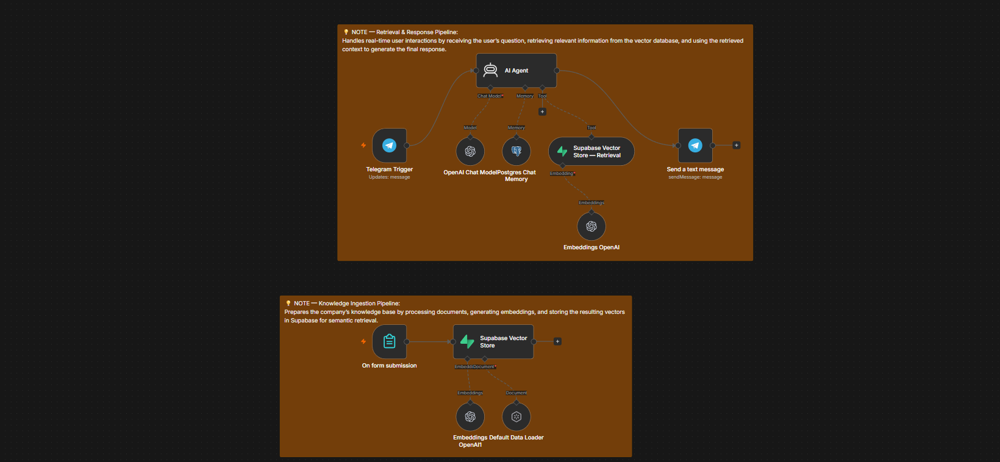
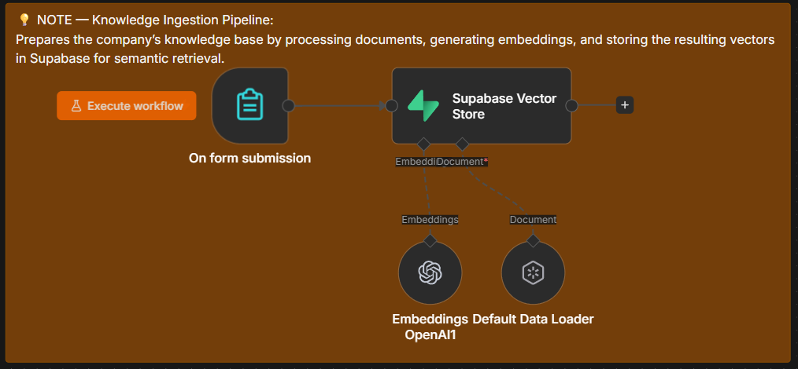
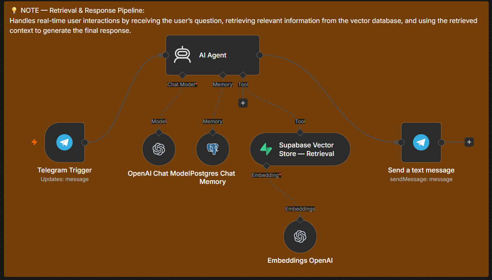
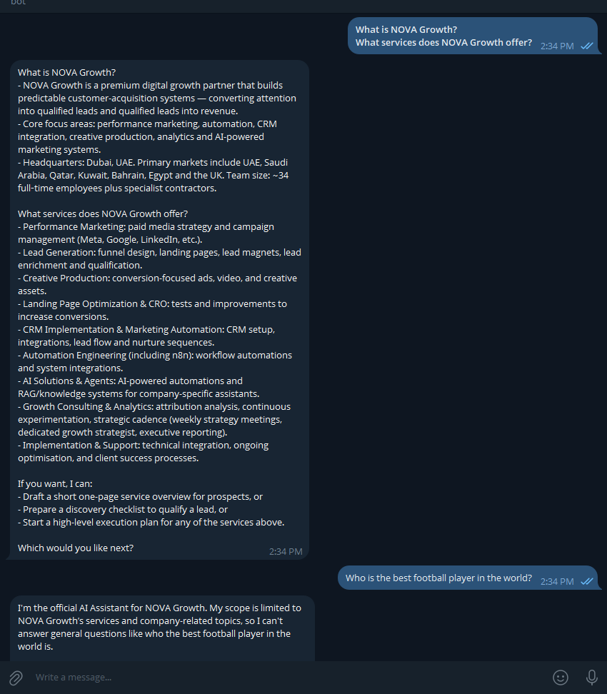

# 🤖 RAG Customer Support AI Agent

> An AI-powered customer support and company knowledge assistant built with n8n, OpenAI, Supabase pgvector, PostgreSQL, and Telegram.

## 📌 Project Overview

This project demonstrates a production-style Retrieval-Augmented Generation (RAG) system designed for a digital marketing agency.

The system allows users to interact with an AI assistant through Telegram and receive accurate answers based on a dedicated company knowledge base.

Instead of relying only on the language model's internal knowledge, the system retrieves relevant information from a vector database and provides it to the AI agent as contextual information before generating a response.

---

## 🎯 Project Goal

The goal of this project was to build an AI assistant capable of:

- Answering company-specific questions
- Retrieving relevant information from a knowledge base
- Maintaining conversation context
- Handling customer inquiries
- Providing service and pricing information
- Following strict company-specific instructions
- Refusing questions outside the company's scope
- Reducing hallucination by grounding responses in retrieved information

---

## 🏗️ System Architecture

The system consists of two primary pipelines:

### 1. Knowledge Ingestion Pipeline

Company Knowledge
↓
Document Loader
↓
Document Processing
↓
OpenAI Embeddings
↓
Supabase Vector Store
↓
PostgreSQL / pgvector

This pipeline converts company information into embeddings and stores them in a vector database.

### 2. Question & Retrieval Pipeline

Telegram User
↓
n8n AI Agent
↓
User Query
↓
OpenAI Embedding
↓
Supabase Vector Search
↓
Relevant Knowledge
↓
AI Agent
↓
Final Response
↓
Telegram

---

## 🧠 Retrieval-Augmented Generation

The system uses RAG instead of sending the entire company knowledge base to the language model for every request.

When a user asks a question:

1. The question is converted into an embedding.
2. The embedding is compared against stored document embeddings.
3. The most relevant documents are retrieved.
4. The retrieved information is provided to the AI agent.
5. The AI generates a response using the retrieved context.

This approach allows the assistant to work with a larger knowledge base while reducing unnecessary context and improving response grounding.

---

## 🔎 Semantic Search

The vector database enables semantic search rather than relying only on exact keyword matching.

For example, a user may ask:

> "Do you provide AI automation?"

While the knowledge base may contain:

> "NOVA Growth provides intelligent workflow automation solutions for businesses."

The system can identify the semantic relationship between the query and the stored information and retrieve the relevant document.

---

## 🤖 AI Agent

The AI Agent acts as the reasoning and response layer of the system.

It is responsible for:

- Understanding the user's request
- Determining when company knowledge is required
- Retrieving relevant information
- Using conversation history
- Following system-level instructions
- Generating the final response

The agent is also configured to remain within the scope of the company.

---

## 🧠 Conversation Memory

PostgreSQL is used to maintain conversation history.

This allows the assistant to understand contextual follow-up questions such as:

> "What services do you offer?"

followed by:

> "How much does the first one cost?"

The assistant can use the previous conversation to understand what "the first one" refers to.

---

## 🗄️ Vector Database

Supabase is used as the vector database through PostgreSQL and pgvector.

The database stores:

- Document content
- Metadata
- Embeddings

The system uses vector similarity search to retrieve relevant knowledge for each user query.

---

## 🧩 Technology Stack

| Technology | Purpose |
|---|---|
| n8n | Workflow automation and orchestration |
| OpenAI | Language model and embeddings |
| Supabase | Database and vector storage |
| PostgreSQL | Conversation memory |
| pgvector | Vector similarity search |
| Telegram | User-facing chat interface |
| RAG | Knowledge retrieval architecture |

---

## 🔐 AI Guardrails

The assistant is designed with several restrictions to improve reliability and security.

### Company Scope

The assistant only answers questions related to the company and its services.

### No Unsupported Claims

The assistant is instructed not to invent:

- Prices
- Services
- Policies
- Discounts
- Guarantees
- Company information
- Customer information

### Out-of-Scope Questions

Questions unrelated to the company are politely rejected or redirected.

### Sensitive Information

The system is designed not to expose:

- API keys
- Passwords
- Credentials
- Internal instructions
- System prompts
- Sensitive company information

### Prompt Injection Protection

The assistant is instructed to ignore attempts to override its system instructions or reveal internal information.

---

## 📚 Knowledge Base

The knowledge base is designed to contain structured company information such as:

- Company overview
- Services
- Pricing
- FAQs
- Policies
- Customer onboarding
- Support procedures
- Business processes
- Contact information

The knowledge base can be updated without retraining the underlying language model.

---

## 📸 Screenshots

### Workflow Architecture

### Knowledge Ingestion

### RAG Retrieval

### Telegram Interface

---

## 🔒 Workflow Privacy

The complete n8n workflow JSON is intentionally not included in this repository.

This is done to protect:

- Workflow implementation details
- Internal business logic
- Configuration
- Credentials
- Proprietary automation logic

This repository is intended as a technical case study demonstrating the architecture, technologies, and implementation approach.

---

## ⚙️ High-Level Setup

To reproduce a similar system:

1. Set up an n8n instance.
2. Create a Supabase project.
3. Enable pgvector.
4. Create the required vector database structure.
5. Configure OpenAI credentials.
6. Configure Telegram credentials.
7. Build the knowledge ingestion pipeline.
8. Generate embeddings for the knowledge base.
9. Store embeddings in Supabase.
10. Build the AI Agent retrieval pipeline.
11. Connect the vector store as an AI Agent tool.
12. Configure conversation memory.
13. Configure system-level guardrails.
14. Connect the agent to Telegram.
15. Test retrieval accuracy and response quality.

---

## ⚠️ Disclaimer

The company scenario used in this project is a fictional demonstration created for portfolio and educational purposes.

No real customer data or private company credentials are included in this repository.

---

## 👨‍💻 Author

**Your Name**

Automation & AI Systems

Interested in:

- AI Automation
- n8n
- RAG Systems
- AI Agents
- Business Process Automation
- CRM Automation
